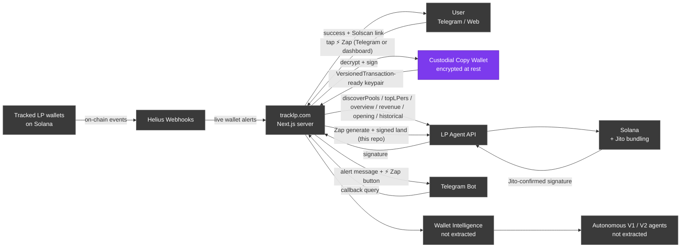

# TrackLP × LP Agent — System Architecture

The TrackLP product is built on top of LP Agent's read API and Zap API.
This diagram shows the full surface; the modules in this repo are the
integration layer extracted as a public case study.

## What's in this repo (`@tracklp/lp-agent-integration`)

- **`src/lpAgent/client.ts`** — typed REST client for the six LP Agent
  read endpoints, with rate limiter, 429 retry, request timeout,
  injectable logger.
- **`src/lpAgent/zap.ts`** — five Zap helpers (`generateZapInTx`,
  `landZapInTx`, `getZapOutQuotes`, `generateZapOutTx`, `landZapOutTx`).
- **`src/lpAgent/executor.ts`** — `Signer` interface +
  `executeZapCopyOpen` / `executeZapCloseOpen` orchestration that
  bundles generate → sign → land with an optional audit hook. Includes
  `serverKeypairSigner()` for the canonical server-held-keypair case.
- **`src/lpAgent/types.ts`** — public-surface types only.

## What's not in this repo (lives at tracklp.com)

- Wallet Intelligence scoring (seven components, gated, calibrated
  over months of live trading).
- Pool originality clustering (unique vs. copy-LP detection).
- Autonomous V1 (rule-based) gate logic. V2 (LLM-driven ranker) is
  in `agent-v2/` as a runnable reference.
- Encrypted custodial keypair management — per-user AES-GCM at rest with
  userId-bound KDF and audit-logged decrypt. The pattern is documented;
  the implementation is application-specific.
- Content engine, dashboard UX.
