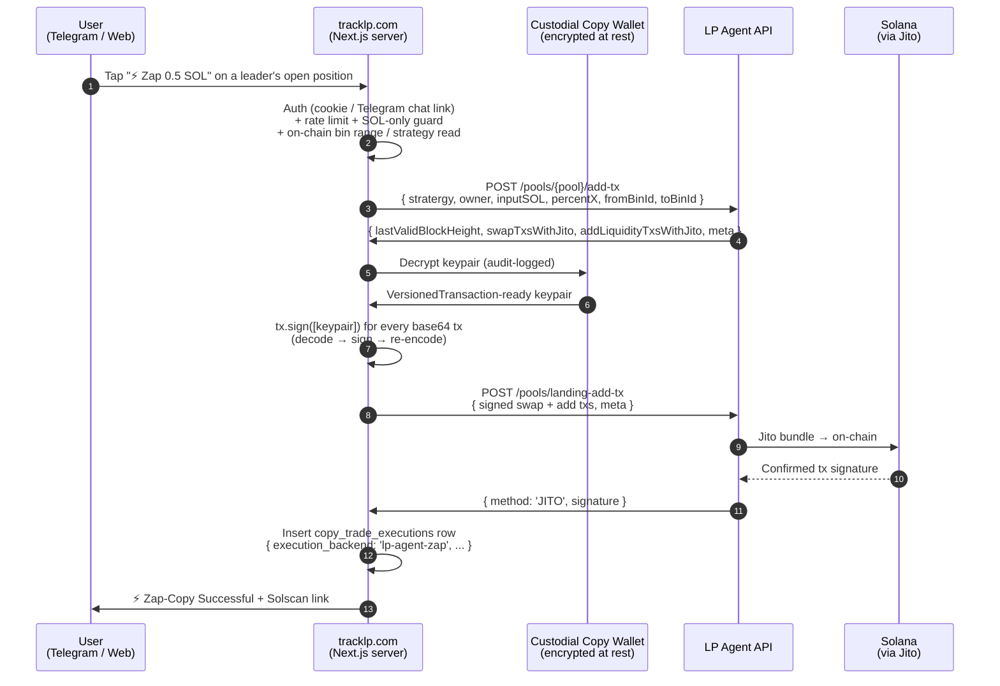

# Zap-in Flow — Sequence Diagram

The Zap-in API is a three-step pattern: server builds the unsigned
transactions, the application signs them (server-side custodial or
browser non-custodial — your choice), then the server lands them via
Jito. The diagram below shows TrackLP's production custodial flow.

## Why three steps instead of one

LP Agent splits the build (`/pools/{pool}/add-tx`) and land
(`/pools/landing-add-tx`) phases so the signing entity can sit between
them. The signer can be:

- A **server-held keypair** (the diagram above) — TrackLP's custodial
  agent wallet pattern. Users delegate signing to a wallet TrackLP holds
  encrypted on their behalf.
- A **browser wallet** (Phantom / Backpack / wallet-adapter) — the user
  signs themselves. Same three steps, the signing happens in step 6 via
  `wallet.signAllTransactions()` instead of `tx.sign([keypair])`.

Both flows route through the same `executeZapCopyOpen` orchestration —
the only thing that changes is which `Signer` implementation you pass.

## Why Jito

Jito-bundled landing avoids the failure mode where the swap tx confirms
but the deposit tx times out (or vice versa). The bundle is atomic on
landing.

## The `percentX` gotcha

LP Agent's docs imply `inputSOL` alone tells the API how much SOL to
deposit. The live API rejects with HTTP 500 "Amount X or Amount Y or
Percent X is required" — `percentX` is required alongside `inputSOL`.
For SOL-only deposits it's binary: `1` if SOL is token X, `0` if SOL is
token Y. See the executor's input docs.

## The `stratergy` gotcha

LP Agent's API spells the strategy field `stratergy` (their typo). Honor
it. Sending `strategy` returns a 400 with a vague error. See
`src/lpAgent/zap.ts` — the wrapper takes `strategy` from the caller and
remaps to `stratergy` on the wire.
